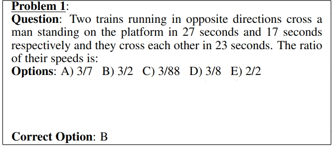
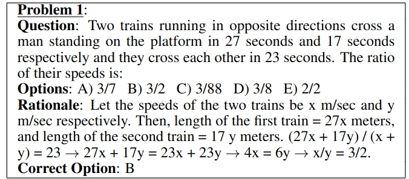
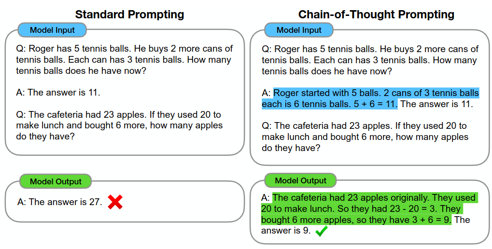
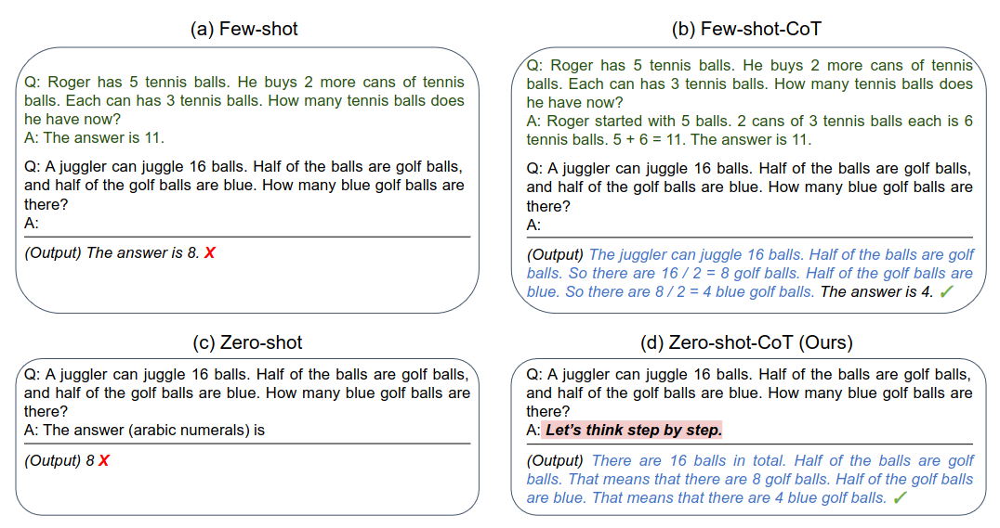
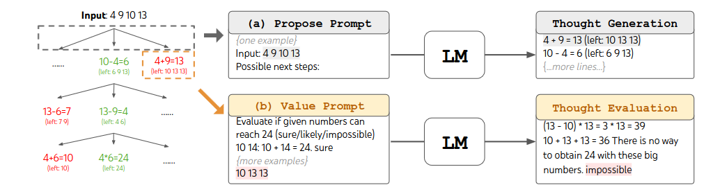
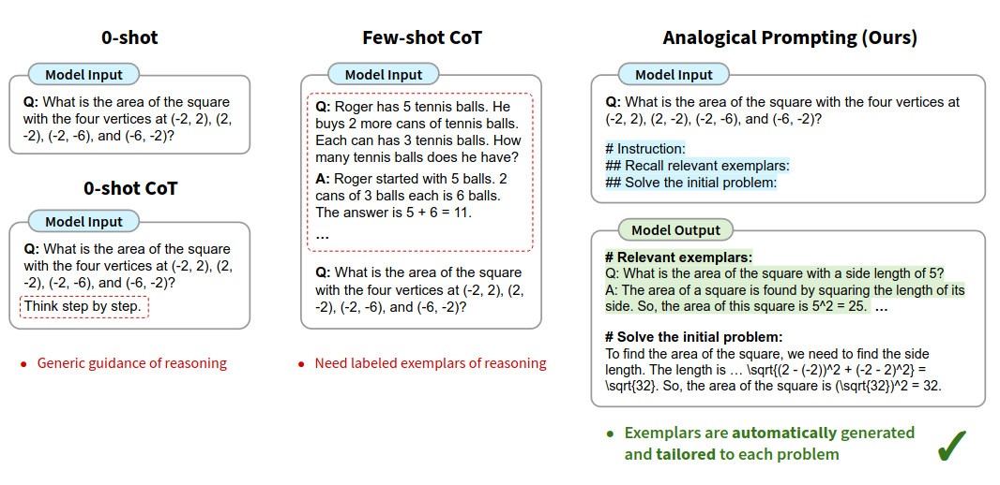
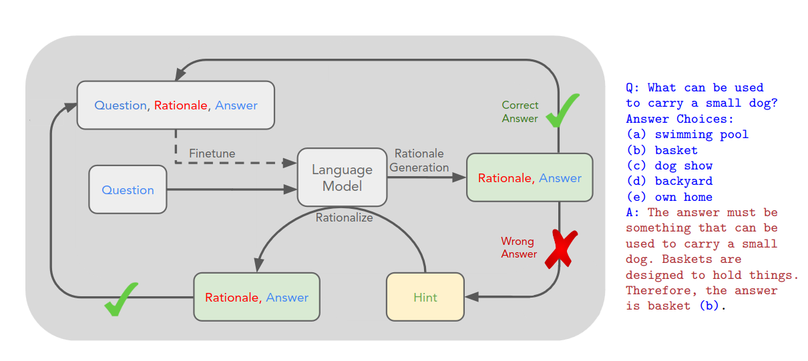
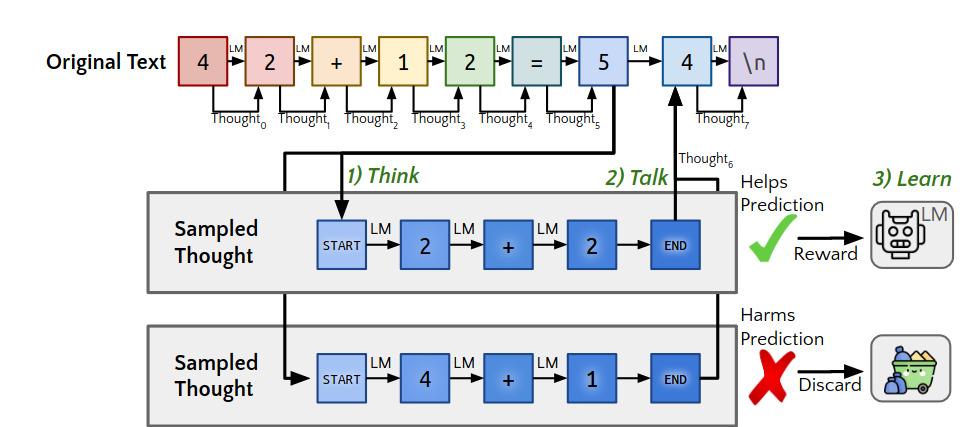
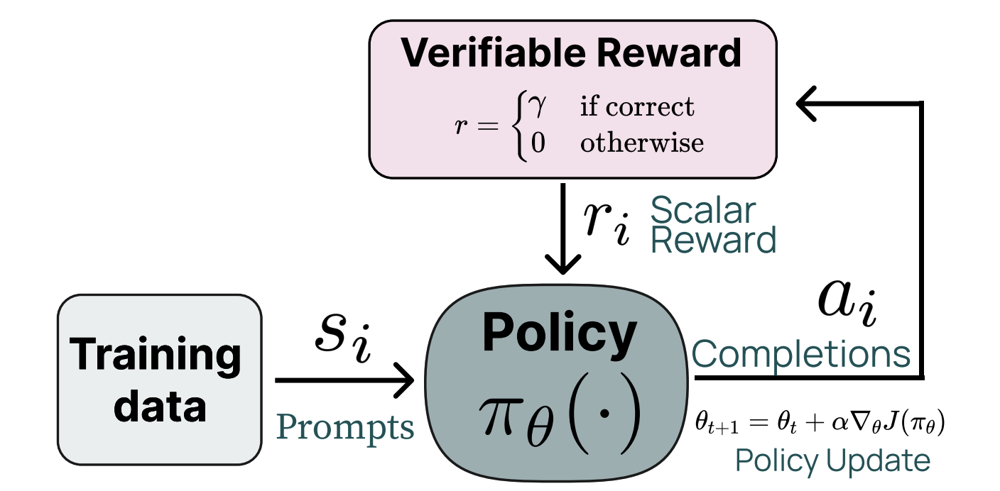

# **Reasoning Language Models**

---

<!--footer: "Course 8: Domain-Specific NLP" -->
## Introduction

---

## Contents

<small>

1. **What is reasoning?**
    a. Reasoning and Decomposition
2. **Prompting Methods, Inference-Time reasoning**
    a. Chain of Thought prompting
    b. Train of Thoughts
    c. Analogical Prompting
3. **Training for reasoning**
    a. RLHF Recap
    b. Rewards and Bootstrapping, STaR, ORM, PRM
    c. Reinforcement Learning with Verifiable Rewards
    d. DeepSeek-R1?
4. **Test-time compute?**
5. **Conclusion and critical questions**

</small>

---

<!--_class: lead -->
## What is reasoning?

---

<!--footer: "Reasoning and decomposition" -->
### Reasoning and Decomposition

<small> 

_Program Induction by Rationale Generation: Learning to Solve and Explain Algebraic Word Problems._ [1]

</small>
 

---

### Reasoning and Decomposition

 

<small>

**Figure 1**: Example of the reasoning problems in _Program Induction by Rationale Generation: Learning to Solve and Explain Algebraic Word Problems._ [1]. This paper, published at ACL in 2017, is the first one to use natural language to describe intermediate reasoning steps.

</small>

---

### Reasoning and Decomposition

_Thinking, Fast and Slow. [2]_

1. **System 1 reasoning**: fast, automatic and unconscious; e.g. recognizing faces, taking quick decisions 
2. **System 2 reasoning**: slow, deliberate, analytical; e.g. solving maths problems

System 1 is prone to **cognitive biases**, System 2 is **rational**. How do machines pass **from System 1 to System 2?**

---

### _Reasoning and Decomposition_

---

<!--_class: lead -->
<!--footer: "Inference time reasoning" -->

## Prompting strategies: inference time reasoning

---

### Chain of Thought Prompting

<small>

**Figure 2** : The 2021 NeurIPS paper by Wei et al. introduced *Chain of Thought (CoT) prompting*, which enables large language models to tackle complex arithmetic, commonsense, and symbolic reasoning tasks. Chain-of-thought reasoning processes are highlighted.

</small>

---

### Chain of Thought prompting

 

<small>

Example inputs and outputs of GPT-3. [3]

</small>

---

### Chain of Thought prompting [4]

CoT introduces intermediate reasoning steps $z_1,\ldots,z_n$ between input $x$ and output $y$:

$$
x \rightarrow z_1 \rightarrow \cdots \rightarrow z_n \rightarrow y
$$

Each thought is generated sequentially:

$$
z_i \sim p^{CoT}_{\theta}(z_i \mid x,z_{1:i-1})
$$

The final answer is generated conditioned on the full chain:

$$
y \sim p^{CoT}_{\theta}(y \mid x,z_{1:n})
$$

---

### Chain of Thought prompting [4]

Summary: reasoning steps and the answer are sampled as a single
continuous sequence:

$$
[z_1,\ldots,z_n,y] \sim
p^{CoT}_{\theta}(z_1,\ldots,z_n,y \mid x)
$$

The **decomposition** of thoughts (phrase, sentence, paragraph, ...) is left ambiguous.

---

### Tree of Thoughts

_Deliberate Problem Solving with Large Language Models_ [4]

1. How to decompose the intermediate process into thought steps
2. How to generate potential thoughts from each state
3. How to heuristically evaluate states
4. What search algorithm to use

---

### Tree of Thoughts

_Deliberate Problem Solving with Large Language Models_ [4]

Example of ToT in a game of 24. The LM is prompted for (a) thought generation and (b) valuation.

---

### Analogical Prompting

_Large Language Models as Analogical Reasoners_ [5]

---

<!--footer: "Reinforcement Learning Recap" -->
<!--_class: lead -->

## Reinforcement Learning Recap
---

### Reinforcement Learning Recap

<small> 

In reinforcement learning, an agent learns from the environment by interacting with it through trial and error and receiving rewards as feedback for performing actions.

The agent does not know the environment beforehand (black box): this is why it is a **learning** process.

</small>

---

### Reinforcement Learning
<ul>
<li> 

**Environment**, with which the agent interacts, outputs **observations** </li>
<li> 

Agent makes **decisions** </li>
<li> 

Agent gets new **observations** </li>
<li> 

Agent gets a **rewards** based on how good (or bad) the actions were. </li>

</li>
</ul>

---

<!--_class: lead -->
<!--footer: "Training for Reasoning" -->
## Training for Reasoning
---

### _STaR: Bootstrapping Reasoning with Reasoning_ [6]

<small>

An overview of STaR and a STaR-generated rationale on CommonsenseQA.Fine-tuning outer loop is the dashed line. Questions and ground truth answers in the dataset, rationales generated using STaR. [4]

</small>

---

#### _STaR: Bootstrapping Reasoning With Reasoning_ [6]

##### Input

- Pretrained LLM **M**
- Dataset:
  $$ D=\{(x_i,y_i)\} $$
- Few-shot rationale examples:
  $$ P=\{(x_i^p,r_i^p,y_i^p)\} $$

---

#### _STaR: Bootstrapping Reasoning With Reasoning_ [6]

##### Iterative loop

1. Generate rationale:
   $$
   M(x_i,P)\rightarrow(\hat r_i,\hat y_i)
   $$

2. Filter:
   $$
   \hat y_i=y_i
   $$

3. Fine-tune on:
   $$
   (x_i,\hat r_i,y_i)
   $$

4. Repeat

---

### RL in STaR

The LLM first generates a rationale $r$ and then predicts an answer $y$.

$$
p_M(y|x)=\sum_r p(r|x)p(y|x,r)
$$

STaR approximates maximizing:

$$
J(M)=
\sum_i
\mathbb{E}_{\hat r_i,\hat y_i}
[\mathbb{1}(\hat y_i=y_i)]
$$

where the reward is **1 only for correct answers**.

---

#### _Quiet-STaR: Language Models Can Teach Themselves to Think Before Speaking_ [5]

 

---

#### Reinforcement Learning with Verifiable Rewards (RLVR)

_Tülu 3: Pushing Frontiers in Open Language Model Post-Training._ [8]

 

---

### RLVR

The model is trained on tasks for which the correctness can be (easily) verified, either in an exact, mathematical way (formal proofs) or through executables (e.g. unit tests).

There is no uniform way of defining a task as verifiable; for example, mathematical proofs are (intuitively) among the most robustly verifiable tasks.

---

### RLVR: Verifying Function

Given a question $x$, a generated solution trajectory is:

$$
\tau = (r_1,\ldots,r_T,y)
$$

where $r_{1:T}$ denotes the reasoning trace and $y$ the final answer.

The verifier $V_\phi$ assigns a score to a candidate solution:

$$
V_\phi(x,\tau) \rightarrow s \in [0,1]
$$

---

### RLVR: Verifying Function

Training data consists of solution trajectories with correctness labels:

$$
\mathcal{D}_V =
\{(x_i,\tau_i,c_i)\}_{i=1}^{N},
\quad c_i \in \{0,1\}
$$

The verifier is optimized 

---

### DeepSeek-R1

---
<!--footer: "Course 10: Reasoning LLMs" -->
<!--_class: lead -->

## Questions?

---

### References -- TODO: Correct Bibliography

[1] Ling, Wang, Yogatama, Dani, Dyer, Chris, and Blunsom, Phil. “[Program Induction by Rationale Generation : Learning to Solve and Explain Algebraic Word Problems.](https://doi.org/10.48550/arXiv.1705.04146.)”, 2017.

[2] Kahneman, Daniel. Thinking, Fast and Slow. Farrar, Straus and Giroux, 2011.

[3] Kojima et al., Large Language Models are Zero-Shot Reasoners, NeurIPS 2022.

---

[4] Yao et al. Tree of Thoughts: Deliberate Problem Solving with Large Language Models. NeurIPS 2023.

[5] Yasunaga et al. Large Language Models as Analogical Reasoners. ICLR 2024.

[6] Zelikman et al. STaR: Bootstrapping Reasoning With Reasoning. NeurIPS 2022.

[7] Wen et al. Reinforcement Learning with Verifiable Rewards Implicitly Incentivizes Correct Reasoning in Base LLMs. 

---

[8] Lambert et al. Tülu 3: Pushing Frontiers in Open Language Model Post-Training. 2025
